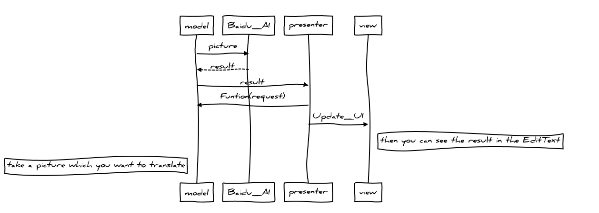
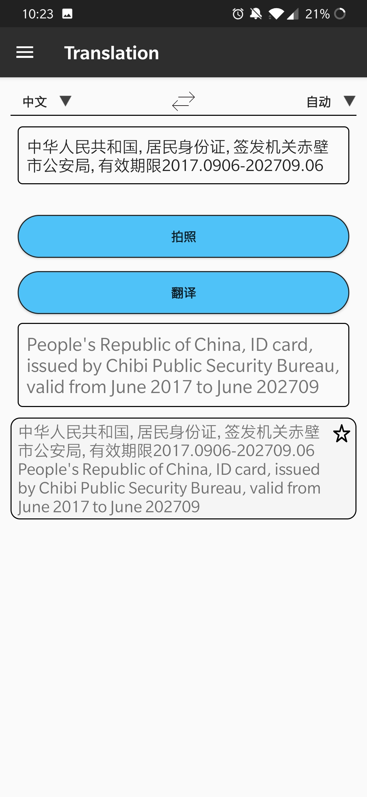

#  Readme

## Table of Contents


	
- [Background](#background)
- [Install](#install)
- [Usage](#usage)
- [Example](#example)
- [Maintainers](#maintainers)
- [Contributing](#contributing)
- [Remember](#remember)
- [License](#license)
  

```sequence{theme="hand"}
model->Baidu_AI:picture
Baidu_AI-->model:result
model->presenter:result
presenter->model:Funtion(request)
presenter->view:Update_UI
Note right of view:then you can see the result in the EditText
Note left of model:take a picture which you want to translate
```

## Background

This is a homework of Android. 


## Install

This project uses ``apk`` to install in you android smart phone
you can install the ``apk`` directly 


## Usage

This is only for simple translation just for study usage. :cry:
And you can take a picture to find text to translate. :smile:

## Example
<div> </div><div> </div>


## Maintainers

[@Ninja](https://github.com/Ninja119347) [@fujunchen]() [@liujiyu]()


## Contributing

 thanks for  [otote](https://github.com/otote/TranslationDemo) 
 and [reggie1996](https://github.com/reggie1996/CharacterRecognition)


## Remember

android_homework this is a applet for translate support by BAIDU API
You must register in http://api.fanyi.baidu.com/api/trans/product/index or http://ai.youdao.com/ and apply for API to complete.

## License

 © by Ninja:smile:
