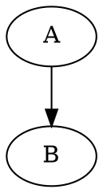

<!-- 标题 -->

# 一级标题
## 二级标题
### 三级标题
#### 四级标题
##### 五级标题
###### 六级标题

<!-- 正文 -->
                                     我是正文
                                


<!-- 代码块 -->

```python
   print("hello world!")
   print("hello markdown!")
```
```python{.line-numbers}
 #!/usr/bin/env python3
print("Hello, World!");
```

<!-- 正文中代码 -->

正文中的代码``print("hello!")``


```bash {cmd=true}
ls .
```
```javascript {cmd="node"}
const date = Date.now()
console.log(date.toString())
```   
<!-- 无序列表 -->
* Item 1
* Item 2
  * Item 2a
  * Item 2b
  * 1. Item 1
  
   <!-- 有序列表 -->
1. Item 2
2. Item 3
   1. Item 3a
   2. Item 3b
 
 <!-- 图片 -->
 
<!-- Format:  -->

   <!-- 链接 -->
http://github.com - 自动生成！
[百度](http://www.baidu.com)
[GitHub](http://github.com)

<!-- 引用 -->
正如 Kanye West 所说：
> We're living the future so
> the present is our past.

<!-- 分隔符 -->
如下，三个或者更多的

---
连字符
***
星号
___
下划线

<!-- 行内代码 -->
我觉得你应该在这里使用
`<addr>` 才对。

<!-- 代码行数 -->
```javascript {.line-numbers}
function add(x, y) {
  return x + y
}
```
 
 <!-- 任务列表 -->
- [x] @mentions, #refs, [links](), **formatting**, and <del>tags</del> supported
- [x] list syntax required (any unordered or ordered list supported)
- [ ] this is a complete item
- [ ] this is an incomplete item
   
<!-- 表格 -->
First Header | Second Header
------------ | -------------
Content from cell 1 | Content from cell 2
Content in the first column | Content in the second column

语文 |  数学 |  英语
-----| ------| -----|
12 |43|23 

:smile: 
:fa-car:
:cry:
:dog:
:cat:
30^th^
H~2~O~2~


Content [^1]
[^1]: Hi! This is a footnote

*[HTML]: Hyper Text Markup Language
*[W3C]:  World Wide Web Consortium
The HTML specification
is maintained by the W3C.

```sequence {theme="hand"}
Andrew->China:Says Hello
Andrew->China:Says Hello
China->Andrew:I am fine
China-->Andrew:I am fine
Andrew->Japan:hello
Andrew->Japan:hello
Note right of China:I am Ninja
Note  over China:I am Ninja
```

```flow
st=>start: Start:>http://www.google.com[blank]
e=>end:>http://www.google.com
op1=>operation: My Operation
sub1=>subroutine: My Subroutine
cond=>condition: Yes
or No?:>http://www.google.com
io=>inputoutput: catch something...
para=>parallel: parallel tasks

st->op1->cond
cond(yes)->io->e
cond(no)->para
para(path1, bottom)->sub1(right)->op1
para(path2, top)->op1
```

```flow
<script src="raphael-min.js"><
<script src="flowchart-latest.js"></script>
<div id="diagram"></div>
<script>
  var diagram = flowchart.parse("the code definition");
  diagram.drawSVG('diagram');

  // you can also try to pass options:

  diagram.drawSVG('diagram', {
                              'x': 0,
                              'y': 0,
                              'line-width': 3,
                              'line-length': 50,
                              'text-margin': 10,
                              'font-size': 14,
                              'font-color': 'black',
                              'line-color': 'black',
                              'element-color': 'black',
                              'fill': 'white',
                              'yes-text': 'yes',
                              'no-text': 'no',
                              'arrow-end': 'block',
                              'scale': 1,
                              // style symbol types
                              'symbols': {
                                'start': {
                                  'font-color': 'red',
                                  'element-color': 'green',
                                  'fill': 'yellow'
                                },
                                'end':{
                                  'class': 'end-element'
                                }
                              },
                              // even flowstate support ;-)
                              'flowstate' : {
                                'past' : { 'fill' : '#CCCCCC', 'font-size' : 12},
                                'current' : {'fill' : 'yellow', 'font-color' : 'red', 'font-weight' : 'bold'},
                                'future' : { 'fill' : '#FFFF99'},
                                'request' : { 'fill' : 'blue'},
                                'invalid': {'fill' : '#444444'},
                                'approved' : { 'fill' : '#58C4A3', 'font-size' : 12, 'yes-text' : 'APPROVED', 'no-text' : 'n/a' },
                                'rejected' : { 'fill' : '#C45879', 'font-size' : 12, 'yes-text' : 'n/a', 'no-text' : 'REJECTED' }
                              }
                            });
</script>
st=>start: Start|past:>http://www.google.com[blank]
e=>end: End|future:>http://www.google.com
op1=>operation: My Operation|past
op2=>operation: Stuff|current
sub1=>subroutine: My Subroutine|invalid
cond=>condition: Yes
or No?|approved:>http://www.google.com
c2=>condition: Good idea|rejected
io=>inputoutput: catch something...|future

st->op1(right)->cond
cond(yes, right)->c2
cond(no)->sub1(left)->op1
c2(yes)->io->e
c2(no)->op2->e
```


```flow
st=>start: Improve your
l10n process!
e=>end: Continue to have fun!:>https://youtu.be/YQryHo1iHb8[blank]
op1=>operation: Go to locize.com:>https://locize.com[blank]
sub1=>subroutine: Read the awesomeness
cond(align-next=no)=>condition: Interested to
getting started?
io=>inputoutput: Register:>https://www.locize.io/register[blank]
sub2=>subroutine: Read about improving
your localization workflow
or another source:>https://medium.com/@adrai/8-signs-you-should-improve-your-localization-process-3dc075d53998[blank]
op2=>operation: Login:>https://www.locize.io/login[blank]
cond2=>condition: valid password?
cond3=>condition: reset password?
op3=>operation: send email
sub3=>subroutine: Create a demo project
sub4=>subroutine: Start your real project
io2=>inputoutput: Subscribe

st->op1->sub1->cond
cond(yes)->io->op2->cond2
cond2(no)->cond3
cond3(no,bottom)->op2
cond3(yes)->op3
op3(right)->op2
cond2(yes)->sub3
sub3->sub4->io2->e
cond(no)->sub2(right)->op1

st@>op1({"stroke":"Red"})@>sub1({"stroke":"Red"})@>cond({"stroke":"Red"})@>io({"stroke":"Red"})@>op2({"stroke":"Red"})@>cond2({"stroke":"Red"})@>sub3({"stroke":"Red"})@>sub4({"stroke":"Red"})@>io2({"stroke":"Red"})@>e({"stroke":"Red","stroke-width":6,"arrow-end":"classic-wide-long"})
```


[TOC]
# 标题1
## 标题2 {ignore=true}
标题2 将会被目录忽略.

<!-- ---
toc:
  depth_from: 1
  depth_to: 6
  ordered: false
---  -->

@import "https://raw.githubusercontent.com/shd101wyy/markdown-preview-enhanced/master/LICENSE.md"
@import "9.jpg" {width="300px" height="200px" title="图片的标题" alt="我的 alt"}
@import "2.pdf"

```bash {cmd=true}
ls .
```

```javascript {cmd="node"}
const date = Date.now()
console.log(date.toString())
```   

